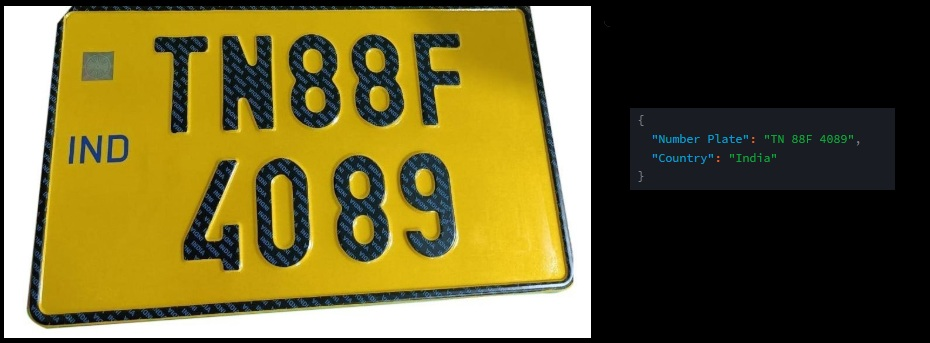
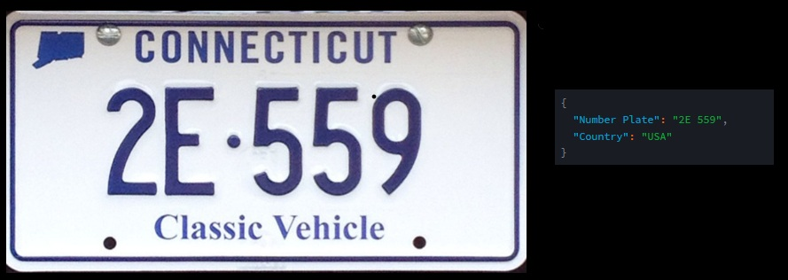

# Number Plate Extractor (NPE)
The **Number Plate Extractor (NPE)** is used to extract the details of the Number plate (registration number) and give the result in **Structured JSON** format. Here we use **Optical Character Recognition (OCR)** technology and **Google's Gemini API key** to extract the details from the Number Plate and to give the result in **Structured JSON** format

## Results of NPE

1 
